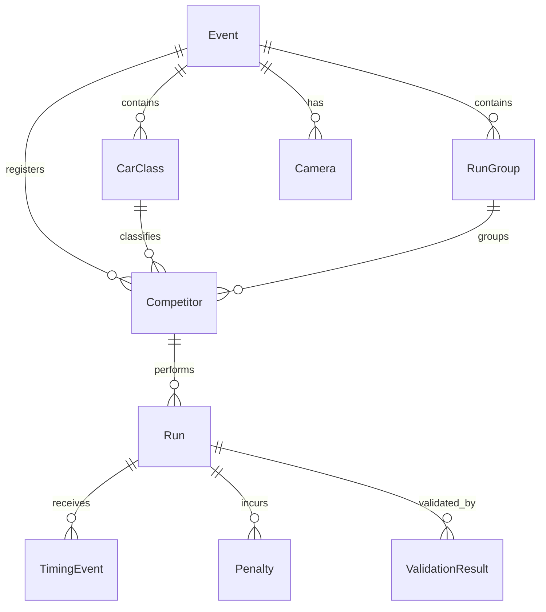
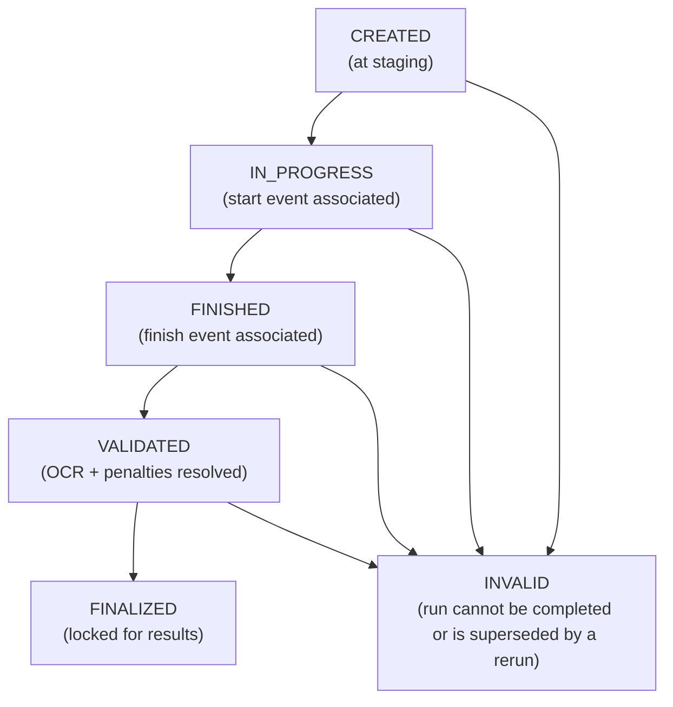

# Data Model Overview
## Project: Race Wrangler – Local‑First Timing and Scoring System for Motorsports
### 1. Purpose
This document provides a high‑level overview of the entities, relationships, and state machines that define the Race Wrangler data model. It serves as the entry point for understanding how timing events, runs, competitors, and validation data are represented within the system.

Detailed specifications for each entity are provided in separate documents within this directory.

### 2. Core Entities
Race Wrangler’s data model consists of the following primary entities:

* Event
* CarClass
* RunGroup
* Competitor
* Run
* TimingEvent
* Penalty
* ValidationResult
* RerunReason
* Camera
* WorkerAssignment
* DeviceSession (for worker tokens)
* EventConfiguration

Each entity is defined in its own document.

### 3. High‑Level Relationships
The following diagram illustrates the major relationships between entities:

```
Event
├── CarClass
│     └── Competitor
├── RunGroup
│     └── Competitor
├── Competitor
│     └── Run
│           ├── TimingEvent
│           ├── Penalty
│           └── ValidationResult
├── Camera
│     └── TimingEvent
├── WorkerAssignment
└── RerunReason
```

Additional notes:

* A Competitor belongs to exactly one CarClass and one RunGroup.
* A Run is created at staging and may exist without any associated timing events.
* A TimingEvent may exist without being associated to a Run.
* A Run may reference a RerunReason if it is marked as a rerun.

### 4. Entity Interaction Summary
| Entity             | Key Relationships                                      |
|--------------------|--------------------------------------------------------|
| Event              | Root container for all other entities                  |
| CarClass           | Groups competitors by competition class                |
| RunGroup           | Defines which competitors run together                 |
| Competitor         | Participant in the event; owns Runs                    |
| Run                | Represents a single competitive attempt                |
| TimingEvent        | Atomic timing data from cameras                        |
| Penalty            | Cones, DNFs, or procedural penalties                   |
| ValidationResult   | Output of validation pipeline                          |
| Finalization       | Records final results for archival and publishing      |
| RerunReason        | Reason for rerun assignment                            |
| Camera             | Timing device generating TimingEvents                  |
| Camera Session     | Timing device role                                     |
| WorkerAssignment   | Defines worker roles for competitors                   |
| DeviceSession      | Tracks worker access tokens                            |
| EventConfiguration | Stores event‑level settings                            |



### 5. Run Lifecycle (State Machine)
A Run progresses through the following states:



### 6. TimingEvent Lifecycle
TimingEvents are created independently of Runs and may be associated later.

RECEIVED
↓
UNASSOCIATED
↓ (auto or manual)
ASSOCIATED
↓
DISCARDED (for false positives)

### 7. Validation Pipeline Overview
Validation results are attached to Runs and may include:

* Number readability
* CarClass correctness
* RunGroup correctness
* Number Mistake Detection warnings
* Starter acknowledgments
* Timing staff resolutions

Each validation output is stored as a ValidationResult entity.

### 8. Rerun Handling
Reruns are represented by:

* Run.is_rerun
* Run.rerun_reason_id
* Run.rerun_of_run_id (optional reference to the replaced run)

Runs replaced by reruns are typically marked INVALID.

### 9. Directory Structure
This overview document is accompanied by individual entity specifications:

```
/docs/data-model/
overview.md
event.md
event-configuration.md
run.md
timing-event.md
competitor.md
car-class.md
run-group.md
penalty.md
validation-result.md
camera.md
worker-assignment.md
rerun-reason.md
```

### 10. Summary
This overview defines the structural foundation of the Race Wrangler data model. Each entity and state machine is documented in detail in its corresponding file. Together, these documents form the authoritative reference for all data stored and processed by the system.